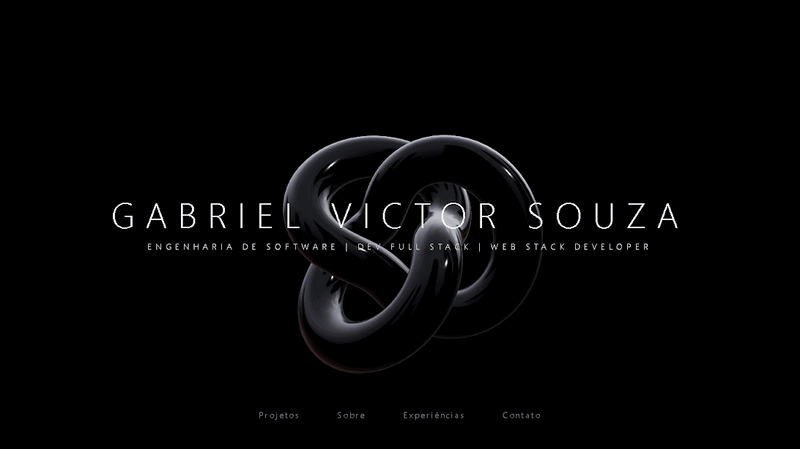
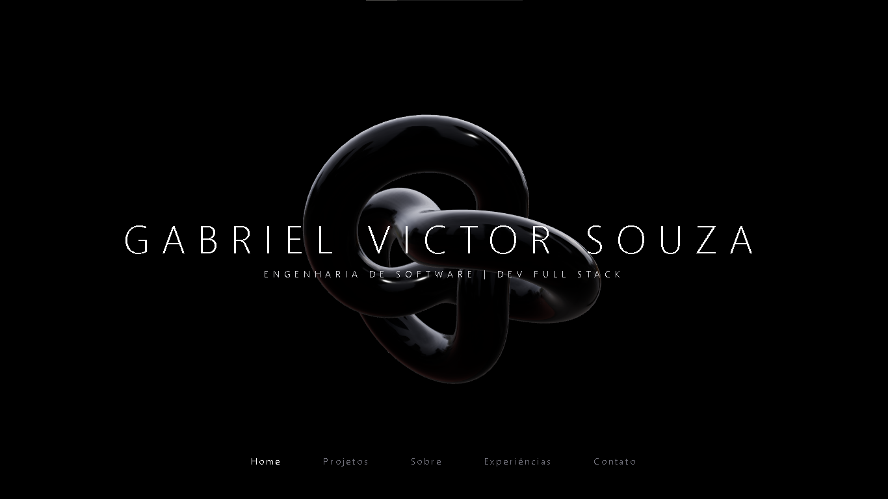
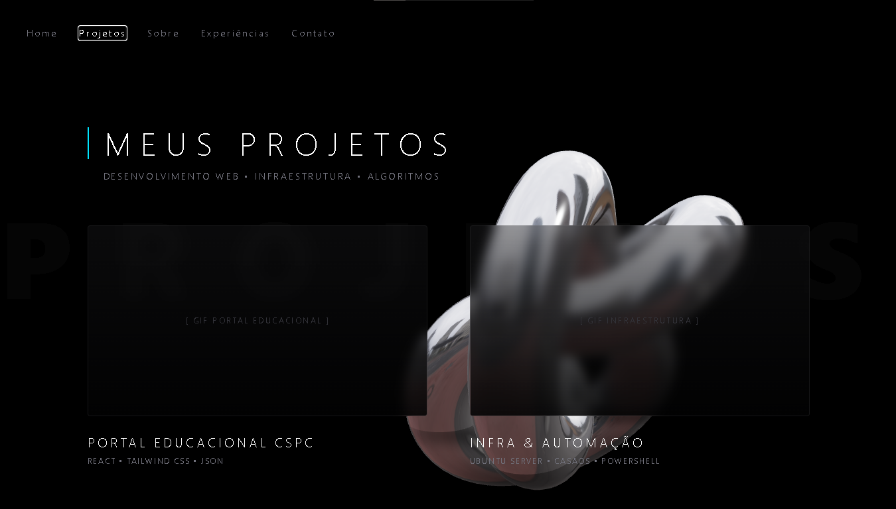
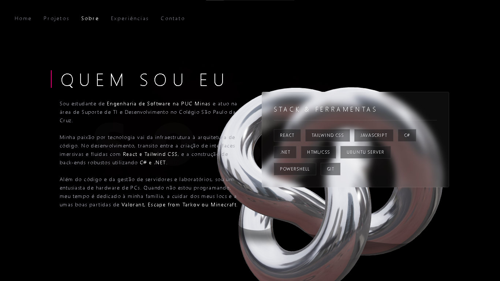
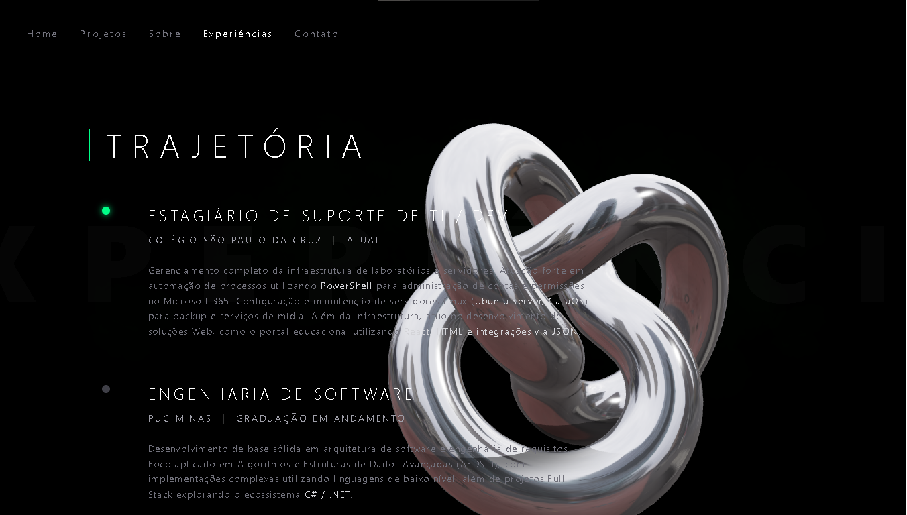
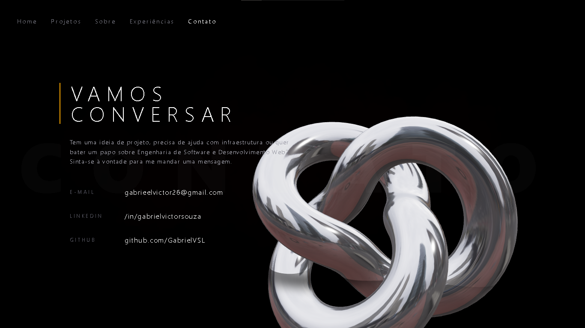

# 🌌 3D Interactive Portfolio - Gabriel Victor Souza

> Um portfólio minimalista, imersivo e de alta performance, construído para destacar habilidades em desenvolvimento web full stack e arquitetura de software.

[](https://portfolio-ten-jade-lthcg1l3d5.vercel.app/)
[](https://react.dev/)
[](https://threejs.org/)

## 📸 Preview do Projeto

<div align="center">
  
  <br />
</div>

---

## 🎨 Design & Wireframes

O design foi focado em uma estética "Dark Tech" minimalista, onde a tipografia fina e os elementos 3D contrastam para criar uma experiência premium, focada na legibilidade e na fluidez.

### Wireframes Iniciais

<div align="center">
  
  <br/><br/>
  
  <br/><br/>
  
  <br/><br/>
  
  <br/><br/>
  
</div>

---

## 🚀 Tecnologias Utilizadas

Este projeto foi construído utilizando um ecossistema moderno para garantir a melhor performance de renderização 3D no navegador:

* **Frontend:** React (via Vite)
* **Estilização:** Tailwind CSS (focado em utilitários e blend-modes)
* **Motor 3D:** Three.js
* **Integração 3D/React:** React Three Fiber (R3F) & Drei
* **Deploy:** Vercel

---

## 💡 Destaques Técnicos

A construção deste portfólio vai além de uma simples landing page, envolvendo conceitos matemáticos e de renderização física:

* **Physically Based Rendering (PBR):** O objeto central (`TorusKnot`) utiliza um `meshStandardMaterial` com altos índices de `metalness` e iluminação baseada em ambiente (HDRI) para gerar reflexos metálicos ultrarrealistas.
* **Interação Orgânica (Lerp):** A rotação do objeto não está presa diretamente ao cursor do mouse. Utilizei **Interpolação Linear (Lerp)** dentro do `useFrame` para calcular a distância entre o objeto e o cursor, aplicando um atraso matemático (`* 0.05`) que cria uma sensação de inércia e peso físico.
* **Blend Modes Avançados:** O texto principal utiliza a classe `mix-blend-difference` do Tailwind, fazendo com que o CSS inverta as cores da tipografia em tempo real conforme as partes claras ou escuras do objeto metálico passam por trás dele.

---

## 👨‍💻 Sobre Mim

Sou estudante de Engenharia de Software na PUC Minas e atuo com suporte e infraestrutura de TI, além de desenvolver aplicações. Tenho um foco forte em construir soluções de ponta a ponta, unindo interfaces fluidas com React e Tailwind a backends robustos construídos com C# e .NET.

---

## 🛠️ Como rodar o projeto localmente

1. Clone o repositório:
```bash
git clone [https://github.com/GabrielVSL/Portfolio](https://github.com/SEU-USUARIO/SEU-REPOSITORIO.git)
```
Acesse a pasta do projeto:
```bash
cd Portifolio/frontend
```
Instale as dependências:

```bash
npm install
```

Inicie o servidor de desenvolvimento:
```bash
npm run dev
```
