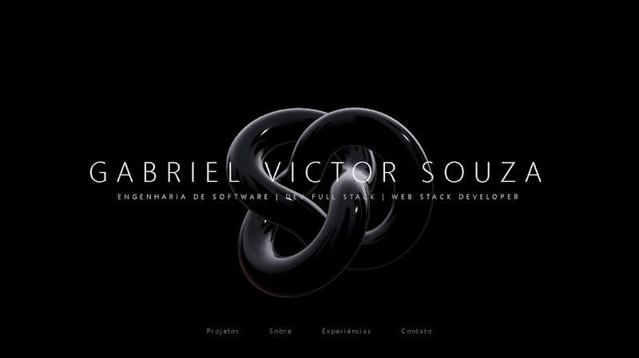
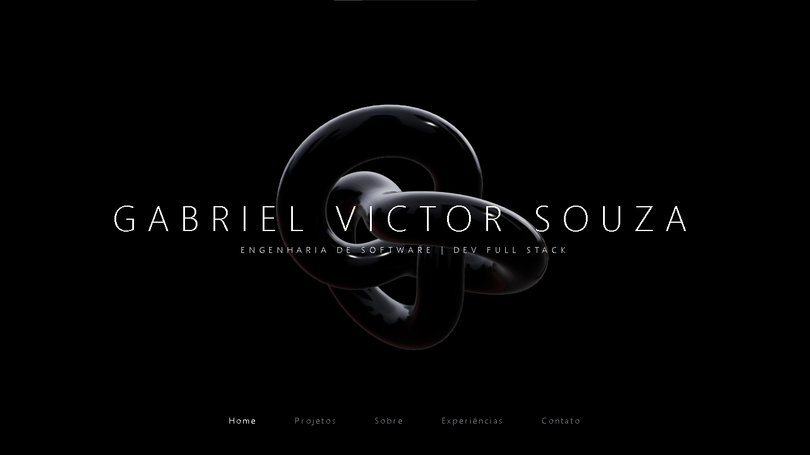
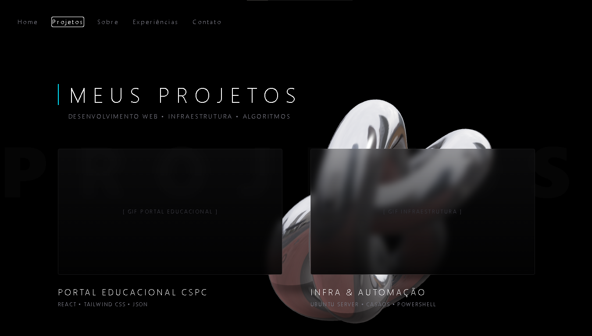
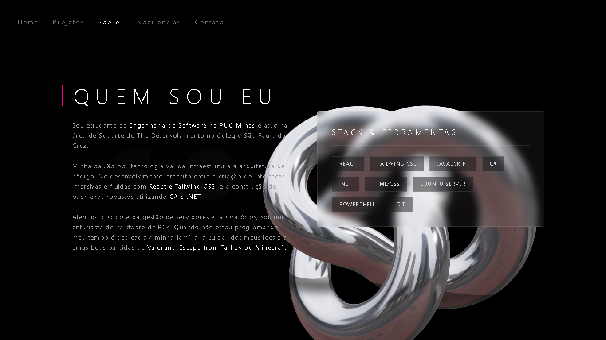
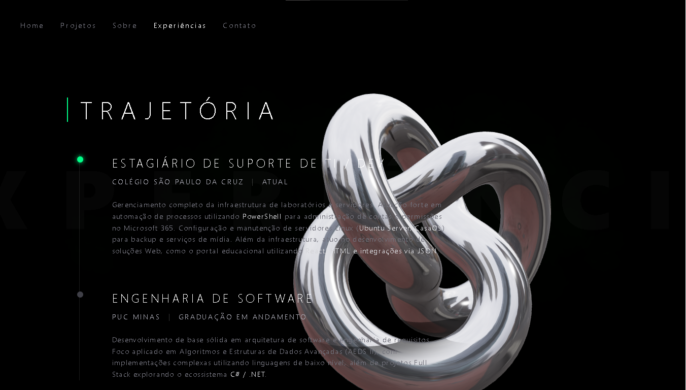
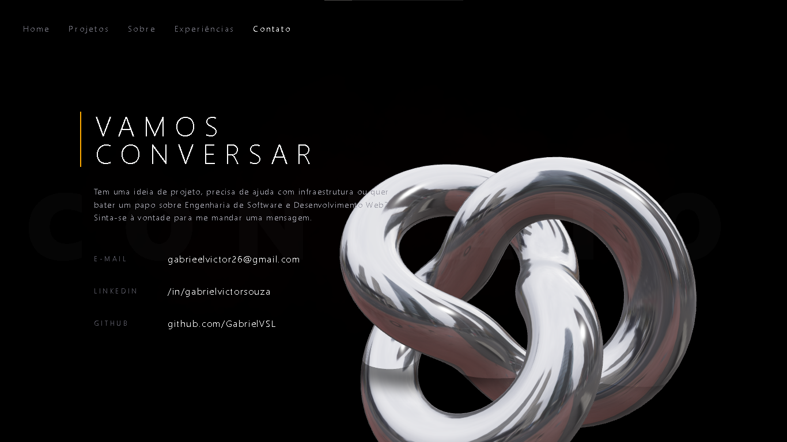

<!-- [](https://classroom.github.com/online_ide?assignment_repo_id=99999999&assignment_repo_type=AssignmentRepo) -->

# 🖥️ Gabriel Victor — Dev Portfolio

> Um portfólio minimalista, imersivo e de alta performance, construído para destacar habilidades em desenvolvimento web full stack e arquitetura de software.

<table>
  <tr>
    <td width="800px">
      <div align="justify">
        Este projeto é um <b>portfólio interativo 3D</b> desenvolvido com <i>React</i>, <i>Three.js</i> e <i>React Three Fiber</i>. Ele combina renderização fisicamente baseada (PBR), interpolação linear (Lerp) e blend modes avançados do CSS para criar uma experiência visual premium e imersiva. O objetivo é demonstrar habilidades técnicas em desenvolvimento front-end moderno, indo além de uma simples landing page ao incorporar conceitos matemáticos e de renderização física diretamente no navegador. O projeto está hospedado na <b>Vercel</b> e representa a identidade profissional de <i>Gabriel Victor Souza</i>, estudante de Engenharia de Software na PUC Minas.
      </div>
    </td>
    <td>
      <div>
        <!-- Substitua pelo logo do seu projeto -->
        
      </div>
    </td>
  </tr>
</table>

---

## 🚧 Status do Projeto

[](https://portfolio-ten-jade-lthcg1l3d5.vercel.app/)
[](https://react.dev/)
[](https://threejs.org/)
[](https://vitejs.dev/)
[](https://tailwindcss.com/)
[](#licença)

---

## 📚 Índice
- [Links Úteis](#-links-úteis)
- [Sobre o Projeto](#-sobre-o-projeto)
- [Funcionalidades Principais](#-funcionalidades-principais)
- [Tecnologias Utilizadas](#-tecnologias-utilizadas)
- [Arquitetura](#-arquitetura)
- [Instalação e Execução](#-instalação-e-execução)
  - [Pré-requisitos](#pré-requisitos)
  - [Como Executar Localmente](#-como-executar-localmente)
- [Deploy](#-deploy)
- [Estrutura de Pastas](#-estrutura-de-pastas)
- [Demonstração](#-demonstração)
- [Documentações Utilizadas](#-documentações-utilizadas)
- [Autores](#-autores)
- [Contribuição](#-contribuição)
- [Licença](#-licença)

---

## 🔗 Links Úteis

* 🌐 **Demo Online:** [Acesse o Portfólio](https://portfolio-ten-jade-lthcg1l3d5.vercel.app/)
  > 💻 Aplicação hospedada na Vercel, com deploy contínuo a partir da branch `main`.
* 💼 **LinkedIn:** [Gabriel Victor Souza](https://www.linkedin.com/in/gabriel-victor-souza)
* :octocat: **GitHub:** [GabrielVSL](https://github.com/GabrielVSL)

---

## 📝 Sobre o Projeto

Este portfólio nasceu da necessidade de criar uma presença online que fosse além do convencional, refletindo minha identidade como desenvolvedor. Em vez de uma página estática com lista de tecnologias, o objetivo foi construir uma **experiência interativa**, onde a própria interface demonstra as habilidades que ela descreve.

O projeto resolve o problema de portfólios genéricos e pouco memoráveis. Ao combinar uma estética "Dark Tech" minimalista com renderização 3D em tempo real diretamente no navegador, ele se destaca tanto visualmente quanto tecnicamente.

O contexto é acadêmico-profissional: foi desenvolvido como vitrine das habilidades adquiridas durante a graduação em Engenharia de Software na PUC Minas e na atuação prática com suporte, infraestrutura e desenvolvimento de aplicações.

---

## ✨ Funcionalidades Principais

- 🌐 **Objeto 3D Interativo:** Um `TorusKnot` metálico com Physically Based Rendering (PBR), que reage ao movimento do mouse em tempo real.
- 🖱️ **Interação com Inércia (Lerp):** A rotação do objeto segue o cursor com atraso matemático, criando sensação de peso e fluidez orgânica.
- 🎨 **Blend Mode Dinâmico:** O texto principal usa `mix-blend-difference`, invertendo suas cores conforme o objeto 3D passa por trás dele.
- 📐 **Design Responsivo:** Layout adaptado para diferentes tamanhos de tela com Tailwind CSS.
- 🚀 **Alta Performance:** Build otimizado com Vite para carregamento rápido.
- 📄 **Seções Completas:** Home, Projetos, Sobre, Experiências e Contato.

---

## 🛠 Tecnologias Utilizadas

### 💻 Front-end

* **Framework:** [React](https://react.dev/) (via Vite)
* **Linguagem:** JavaScript ES6+
* **Estilização:** [Tailwind CSS](https://tailwindcss.com/) — focado em utilitários e blend modes
* **Motor 3D:** [Three.js](https://threejs.org/)
* **Integração 3D/React:** [React Three Fiber (R3F)](https://docs.pmnd.rs/react-three-fiber) & [Drei](https://github.com/pmndrs/drei)
* **Build Tool:** [Vite](https://vitejs.dev/)

### ⚙️ Infraestrutura & Deploy

* **Hospedagem:** [Vercel](https://vercel.com/) — deploy contínuo via integração com GitHub

---

## 🏗 Arquitetura

O projeto segue uma arquitetura de **Single Page Application (SPA)** com React, onde cada seção do portfólio é um componente independente renderizado via roteamento client-side.

A camada de renderização 3D é isolada em seu próprio componente (`<Canvas>` do React Three Fiber), que gerencia o ciclo de vida do Three.js de forma declarativa. A lógica de interação (Lerp + mouse tracking) vive dentro do hook `useFrame`, que roda a cada frame do loop de animação sem bloquear a thread principal do React.

**Padrões adotados:**
- **Component-Based Architecture:** Separação clara entre componentes de UI e de cena 3D.
- **Hook Pattern:** Lógica de animação e interação encapsulada em hooks customizados.
- **Utility-First CSS:** Estilização com classes atômicas do Tailwind, evitando CSS global desnecessário.

### Wireframes Iniciais

| Home | Projetos |
| :---: | :---: |
|  |  |
| **Sobre** | **Experiências** |
|  |  |
| **Contato** | |
|  | |

---

## 🔧 Instalação e Execução

### Pré-requisitos

* **Node.js:** Versão LTS (v18.x ou superior)
* **Gerenciador de Pacotes:** npm ou yarn

### 🔑 Variáveis de Ambiente

Este projeto front-end não requer variáveis de ambiente obrigatórias para execução local. Caso você adicione integrações externas (ex: EmailJS para o formulário de contato), crie um arquivo **`.env.local`** na raiz da pasta `/frontend`:

| Variável | Descrição | Exemplo |
| :--- | :--- | :--- |
| `VITE_EMAILJS_SERVICE_ID` | ID do serviço EmailJS (se aplicável) | `seu_service_id_aqui` |
| `VITE_EMAILJS_TEMPLATE_ID` | ID do template EmailJS (se aplicável) | `seu_template_id_aqui` |
| `VITE_EMAILJS_PUBLIC_KEY` | Chave pública do EmailJS (se aplicável) | `sua_public_key_aqui` |

> **Obs:** Variáveis em projetos Vite precisam do prefixo `VITE_` para ficarem disponíveis no bundle do cliente.

### ⚡ Como Executar Localmente

1. **Clone o repositório:**
```bash
git clone https://github.com/GabrielVSL/Portfolio.git
```

2. **Acesse a pasta do front-end:**
```bash
cd Portfolio/frontend
```

3. **Instale as dependências:**
```bash
npm install
```

4. **Inicie o servidor de desenvolvimento:**
```bash
npm run dev
```

🎨 *O projeto estará disponível em **http://localhost:5173**.*

---

## 🚀 Deploy

O deploy é feito automaticamente na **Vercel** a cada push para a branch `main`.

Para fazer um build manual de produção:

```bash
cd frontend
npm run build
```

Os arquivos estáticos serão gerados na pasta `/dist` e podem ser servidos por qualquer servidor web estático (Vercel, Netlify, etc.).

---

## 📂 Estrutura de Pastas

```
.
├── .gitignore                   # 🧹 Ignora arquivos não versionados (node_modules, .env, dist, etc.)
├── README.md                    # 📘 Documentação principal do projeto
│
└── /frontend                    # 📁 Aplicação React
    ├── .env.local               # 🔒 Variáveis de ambiente locais (não versionado)
    ├── index.html               # 📄 Entry point HTML
    ├── vite.config.js           # ⚙️ Configuração do Vite
    ├── tailwind.config.js       # 🎨 Configuração do Tailwind CSS
    ├── package.json             # 📦 Dependências e scripts
    │
    ├── /public                  # 📂 Arquivos estáticos públicos
    │
    ├── /assets                  # 🖼️ Recursos do projeto
    │   ├── /images              # 🖼️ Imagens e GIFs de demonstração
    │   └── /wireframe           # 📐 Wireframes das telas
    │
    └── /src                     # 📂 Código-fonte React
        ├── main.jsx             # 🚀 Entry point da aplicação
        ├── LandingPage.jsx      # 🏠 Componente raiz
        ├── /components          # 🧱 Componentes reutilizáveis
        │   ├── /3d              # 🌐 Componentes de cena Three.js / R3F
        │   └── /ui              # 💄 Componentes de interface
        └── /pages               # 📄 Seções/páginas do portfólio
            ├── Home.jsx
            ├── Projects.jsx
            ├── About.jsx
            ├── Experience.jsx
            └── Contact.jsx

```

---

## 🎥 Demonstração

### 🌐 Aplicação Web

| Tela | Captura de Tela |
| :---: | :---: |
| **Página Inicial (Home)** | **Seção de Projetos** |
|  |  |
| **Sobre** | **Contato** |
|  |  |

- Preview animado (exemplo de fluxo):

<div align="center">
  
</div>

---

## 💡 Destaques Técnicos

* **Physically Based Rendering (PBR):** O `TorusKnot` central utiliza `meshStandardMaterial` com altos índices de `metalness` e iluminação baseada em ambiente (HDRI), gerando reflexos metálicos ultrarrealistas.
* **Interação Orgânica (Lerp):** A rotação do objeto não está presa diretamente ao cursor. Utilizei **Interpolação Linear (Lerp)** dentro do `useFrame`, aplicando um atraso matemático (`* 0.05`) que cria sensação de inércia e peso físico.
* **Blend Modes Avançados:** O texto principal usa `mix-blend-difference` do Tailwind, invertendo as cores da tipografia em tempo real conforme o objeto metálico passa por trás dele.

---

## 🔗 Documentações Utilizadas

* 📖 **React:** [Documentação Oficial](https://react.dev/reference/react)
* 📖 **Vite:** [Guia de Configuração](https://vitejs.dev/config/)
* 📖 **Three.js:** [Documentação Oficial](https://threejs.org/docs/)
* 📖 **React Three Fiber:** [Documentação R3F](https://docs.pmnd.rs/react-three-fiber/getting-started/introduction)
* 📖 **Drei:** [Repositório e Docs](https://github.com/pmndrs/drei)
* 📖 **Tailwind CSS:** [Documentação Oficial](https://tailwindcss.com/docs)
* 📖 **Conventional Commits:** [Padrão de Mensagens](https://www.conventionalcommits.org/en/v1.0.0/)

---

## 👥 Autores

| 👤 Nome | 🖼️ Foto | :octocat: GitHub | 💼 LinkedIn |
|---------|----------|-----------------|-------------|
| Gabriel Victor Souza | <div align="center"></div> | <div align="center"><a href="https://github.com/GabrielVSL"></a></div> | <div align="center"><a href="https://www.linkedin.com/in/gabrielvictorsouza"></a></div> |

---

## 🤝 Contribuição

1. Faça um `fork` do projeto.
2. Crie uma branch para sua feature (`git checkout -b feature/minha-feature`).
3. Commit suas mudanças (`git commit -m 'feat: Adiciona nova funcionalidade X'`). **(Utilize [Conventional Commits](https://www.conventionalcommits.org/en/v1.0.0/))**
4. Faça o `push` para a branch (`git push origin feature/minha-feature`).
5. Abra um **Pull Request (PR)**.

---

## 🙏 Agradecimentos

* [**Engenharia de Software PUC Minas**](https://www.instagram.com/engsoftwarepucminas/) — Pelo suporte institucional e fomento às boas práticas de engenharia.
* [**Prof. Dr. João Paulo Aramuni**](https://github.com/joaopauloaramuni) — Pelos ensinamentos sobre Arquitetura de Software e Padrões de Projeto.

---

## 📄 Licença

Este projeto é distribuído sob a **[Licença MIT](./LICENSE)**.

---
